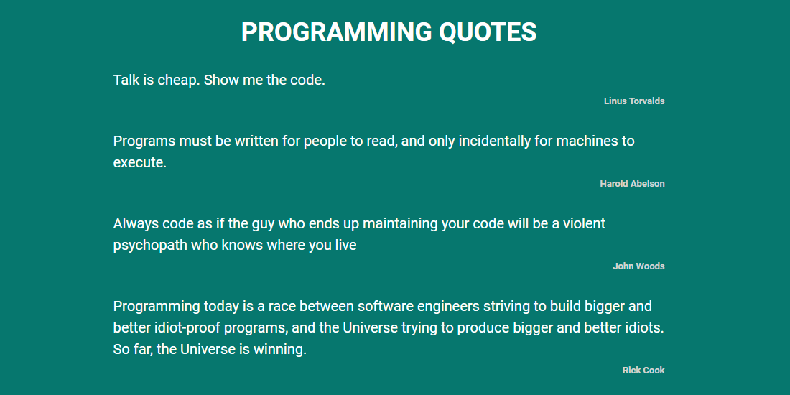

# SCROLL-INFINITE

Scroll-Infinite project created using the Quotes API. The idea of ​​the project is to show 10 citations with each load and as the page scrolls, new citations are loaded.

## 🚀 Technologies :

**Front-end:** HTML5, CSS3 and JAVASCRIPT;

## 👩‍💻 Functionalities:

- Show quotes;

## 💻 How to use :

Project Link : https://project-infinite-scroll.vercel.app/

## 👨 Author :

[@jhonathanSousa](https://www.linkedin.com/in/jhonathan-alves-sousa/)

